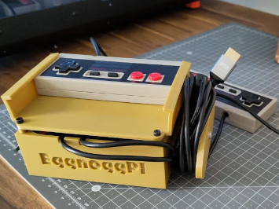
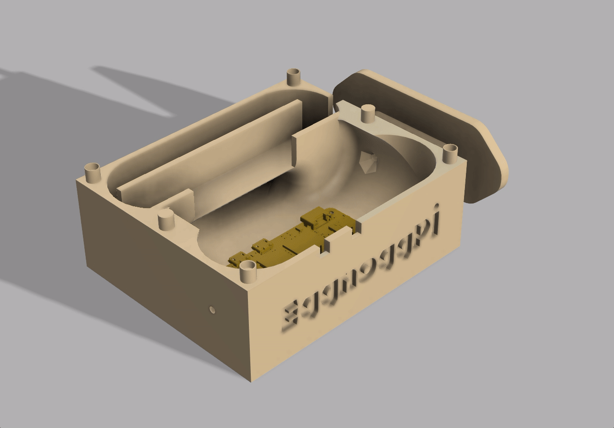

# EggnoggPI



---

## 🎮 Eggnogg+ on the Raspberry PI !

For all of you who need to run eggnoggplus on a raspberry pi to get frenzied parties **instantly**, EggnoggPI is for you.

In this readme, you will see how to setup a PI02W to autostart with EggnoggPI, so you only need to connect 2 controller, and a screen, power on the pi, and play !



## 🦾 Hardware needed

* [Raspberry PI02W](https://www.kubii.com/en/nano-computers/3455-raspberry-pi-zero-2-w-5056561800004.html)
* Micro-SD Card (4GB)
* Mini-HDMI cable
* 5V 2.5A power supply
* [AuviPal Hub Micro USB OTG 3 Ports + Power](https://www.amazon.fr/gp/product/B083WML1XB)
* [2 PCS Wired USB NES Conroller Game Joypad](https://fr.aliexpress.com/item/1005001611443967.html)
* For the case, use the 3D source files with 3D printer

*Estimated total cost arround 50$*

## 👨‍🔧 Hardware install

* Hub Micro USB need to be connected on the Raspberry "**USB** port" (and not on the "Power port"). 

* Plug the 2 USB NES Controller on the Hub Muicro USB.

## 🍓 Setup Raspbian Lite 64 bit

First thing first, you'll need to install raspbian lite on your pi, you can do this just by downloading rpi-image from the official raspberry pi website https://www.raspberrypi.com/software

You'll then only need a minimum of 4Gb µSD card, and install raspbian lite **64 bit** on it.

https://www.raspberrypi.com/documentation/computers/getting-started.html

Connect, setup Wi-Fi and run somes update.

## 📥 Install

```shell
sudo apt install -y git 
git clone https://git.heuzef.com/Flutter/eggnoggpi.git
cd eggnoggpi
sudo apt install -y ./box64.deb 
sudo apt install --no-install-recommends -y ./eggnoggpi.deb # When the prompt ask for enabling nodm, choose "yes"
sudo reboot
```

# 💗 Credits

## Authors

* 🇫🇷 Heuzef (heuzef.com) contact@heuzef.com

* 🇫🇷 FlutterBrony (admtz.fr) antoinemz@gmail.com

* EGGNOGG+ by Madgarden (madgarden.net)


# 📜 Licence

...
